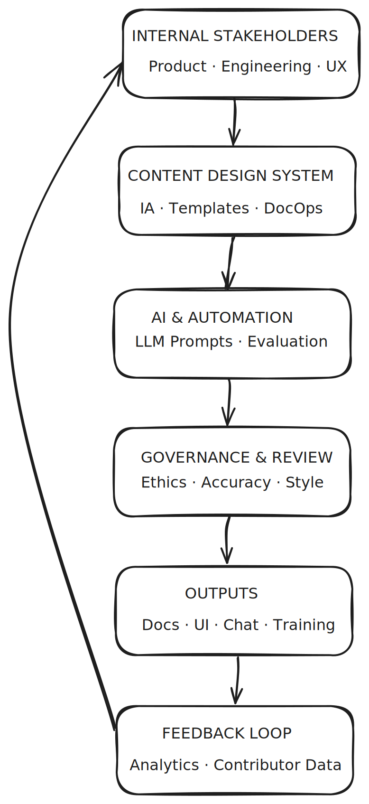

# Building Internal Content Partnerships Across Product Teams

### Context
Large enterprise software ecosystems depend on clear, consistent internal content — style guides, UX documentation, onboarding materials, and governance frameworks. At IBM Data & AI, multiple global product teams maintained their own documentation silos, resulting in duplicated effort, drift in tone, and uneven compliance with accessibility and brand standards.

The challenge was to build a **content partnership model** connecting product, engineering, and UX teams through shared content systems and governance practices.

Diagram showing internal stakeholders feeding into the content design system and completing the feedback cycle.

---

### Goals
- Create a unified content governance system for multiple internal teams.  
- Reduce duplication and time-to-publish for shared documentation.  
- Improve cross-team collaboration and author experience.  
- Establish trust and ownership between content, design, and engineering.

---

### My Role
**Staff Content Designer and Internal Content Partner**

I led the effort to architect a partnership framework for internal content operations, focusing on:

- Building shared documentation workflows and templates in Markdown and Git.  
- Co-designing content contribution models with engineering and UX.  
- Creating governance checklists and editorial review standards.  
- Leading workshops to align tone, taxonomy, and internal naming conventions.  
- Measuring impact with doc-findability analytics and contributor activity metrics.

---

### Approach

#### 1. Discovery
- Interviewed 20+ stakeholders across design, engineering, and PM roles to understand pain points.  
- Mapped current documentation flows and found overlapping effort across 4 teams.  
- Identified missing governance checkpoints and inconsistent tool use.

#### 2. Co-Designing the Partnership Model
- Designed a **shared contribution model** using GitHub pull requests, content templates, and branch reviews.  
- Created **editorial playbooks** for internal docs (component docs, API references, microcopy guides).  
- Introduced **content partnership roles**: Author, Reviewer, Maintainer, and Governance Lead.

#### 3. Governance and Automation
- Automated accessibility checks and linting using markdown-lint and plain-language validators.  
- Developed a “docs readiness” checklist for internal publishing.  
- Built dashboards to visualise contribution frequency and review latency.

#### 4. Training and Rollout
- Facilitated internal workshops with engineering and design partners.  
- Distributed internal newsletters summarising “content wins” to foster community engagement.  
- Documented workflows in a shared internal wiki and Git repo.

---

### Results
| Metric | Before | After | Improvement |
|--------|---------|--------|-------------|
| Duplicate content ratio | 35% | 10% | ↓ 25 pts |
| Time to publish internal doc | 10 days | 3 days | 70% faster |
| Contributors engaged | 8 | 24 | +200% |
| Style guide compliance | 60% | 95% | ↑ 35 pts |

---

### Artifacts
- Governance checklist (`governance-checklist.pdf`)  
- Contribution model diagram (`content-partnership-flow.png`)  
- Internal style guide templates (Markdown)  
- Screenshot of contribution dashboard (optional future upload)

---

### Reflection
This project demonstrated that **content partnerships are design systems for people** — aligning not only content but relationships and incentives. The success relied less on enforcing rules and more on designing workflows that make good content behaviour easy.

This approach can scale across organisations, where internal partnerships between content, product, and design are essential to maintain a coherent experience across a complex product ecosystem.

---

**Keywords:** internal content, governance, cross-functional collaboration, systems design, AI documentation, enterprise content operations.
