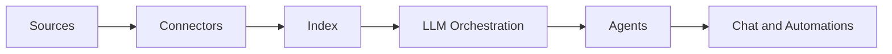

# Architecture
Use a mermaid diagram here to show sources. connectors. indexes. policies. agents. and surfaces.

```mermaid
flowchart LR
  A[Sources] --> B[Connectors]
  B --> C[Index]
  C --> D[LLM Orchestration]
  D --> E[Agents]
  E --> F[Chat and Automations]
```
